# Design da Aplicação Móvel - TreeInspector

## 📱 Arquitetura Mobile React Native

### Princípios de Design
- **Offline-First**: Funciona completamente sem conexão
- **Material Design**: Interface consistente e familiar
- **Performance**: Otimizada para dispositivos móveis
- **Usabilidade**: Fluxo intuitivo para inspetores em campo

## 🏗️ Arquitetura da Aplicação


## 📋 Estrutura de Telas

### 1. Fluxo de Autenticação
```
LoginScreen
├── Campos: email, senha
├── Botões: Entrar, Esqueci a senha
└── Navegação: → TabNavigator (sucesso)

ForgotPasswordScreen
├── Campo: email
├── Botão: Enviar link
└── Navegação: ← LoginScreen
```

### 2. Navegação Principal (Tab Navigator)
```
TabNavigator
├── 🏠 Home (InspectionListScreen)
├── 🌳 Árvores (TreeListScreen)
├── 📍 Mapa (TreeMapScreen)
├── 🔄 Sync (SyncScreen)
└── ⚙️ Configurações (SettingsScreen)
```

### 3. Fluxo de Inspeção
```
InspectionListScreen
├── Lista de inspeções pendentes/concluídas
├── Botão: + Nova Inspeção
└── Navegação: → NewInspectionScreen

NewInspectionScreen
├── Buscar árvore existente
├── Criar nova árvore
└── Navegação: → InspectionFormScreen

InspectionFormScreen (Wizard)
├── Passo 1: Identificação da Árvore
├── Passo 2: Dados Dendrométricos
├── Passo 3: Estado Fitossanitário
├── Passo 4: Condições do Entorno
├── Passo 5: Avaliação de Risco
├── Passo 6: Ações de Manejo
└── Passo 7: Fotos e Finalização
```

## 🎨 Design System

### Cores (Material Design 3)
```javascript
const theme = {
  colors: {
    primary: '#2E7D32',      // Verde principal
    primaryVariant: '#1B5E20', // Verde escuro
    secondary: '#FF8F00',     // Laranja (atenção)
    secondaryVariant: '#E65100', // Laranja escuro
    background: '#FAFAFA',    // Fundo claro
    surface: '#FFFFFF',       // Superfície
    error: '#D32F2F',         // Erro
    warning: '#FF9800',       // Aviso
    success: '#4CAF50',       // Sucesso
    onPrimary: '#FFFFFF',     // Texto sobre primário
    onSecondary: '#000000',   // Texto sobre secundário
    onBackground: '#212121',  // Texto sobre fundo
    onSurface: '#212121',     // Texto sobre superfície
  }
};
```

### Tipografia
```javascript
const typography = {
  h1: { fontSize: 32, fontWeight: '300' },
  h2: { fontSize: 28, fontWeight: '400' },
  h3: { fontSize: 24, fontWeight: '400' },
  h4: { fontSize: 20, fontWeight: '500' },
  h5: { fontSize: 18, fontWeight: '500' },
  h6: { fontSize: 16, fontWeight: '500' },
  body1: { fontSize: 16, fontWeight: '400' },
  body2: { fontSize: 14, fontWeight: '400' },
  caption: { fontSize: 12, fontWeight: '400' },
  button: { fontSize: 14, fontWeight: '500', textTransform: 'uppercase' }
};
```

### Espaçamento
```javascript
const spacing = {
  xs: 4,
  sm: 8,
  md: 16,
  lg: 24,
  xl: 32,
  xxl: 48
};
```

## 📱 Telas Detalhadas

### 1. LoginScreen
```jsx
// Componentes principais
<SafeAreaView>
  <ScrollView>
    <View style={styles.header}>
      <Image source={logo} />
      <Text variant="h4">TreeInspector</Text>
      <Text variant="body2">Inspeção de Árvores</Text>
    </View>
    
    <View style={styles.form}>
      <TextInput
        label="Email"
        value={email}
        onChangeText={setEmail}
        keyboardType="email-address"
        autoCapitalize="none"
      />
      
      <TextInput
        label="Senha"
        value={password}
        onChangeText={setPassword}
        secureTextEntry
      />
      
      <Button
        mode="contained"
        onPress={handleLogin}
        loading={isLoading}
      >
        Entrar
      </Button>
      
      <Button
        mode="text"
        onPress={() => navigation.navigate('ForgotPassword')}
      >
        Esqueci minha senha
      </Button>
    </View>
  </ScrollView>
</SafeAreaView>
```

### 2. InspectionListScreen
```jsx
<SafeAreaView>
  <Appbar.Header>
    <Appbar.Content title="Inspeções" />
    <Appbar.Action
      icon="sync"
      onPress={handleSync}
      disabled={!isOnline}
    />
  </Appbar.Header>
  
  <View style={styles.stats}>
    <Card>
      <Card.Content>
        <Text variant="h6">{pendingCount}</Text>
        <Text variant="body2">Pendentes</Text>
      </Card.Content>
    </Card>
    
    <Card>
      <Card.Content>
        <Text variant="h6">{completedCount}</Text>
        <Text variant="body2">Concluídas</Text>
      </Card.Content>
    </Card>
  </View>
  
  <FlatList
    data={inspections}
    renderItem={({ item }) => (
      <InspectionCard
        inspection={item}
        onPress={() => navigateToInspection(item)}
      />
    )}
    refreshControl={
      <RefreshControl
        refreshing={isRefreshing}
        onRefresh={handleRefresh}
      />
    }
  />
  
  <FAB
    icon="plus"
    onPress={() => navigation.navigate('NewInspection')}
    style={styles.fab}
  />
</SafeAreaView>
```

### 3. InspectionFormScreen (Wizard)
```jsx
<SafeAreaView>
  <Appbar.Header>
    <Appbar.BackAction onPress={handleBack} />
    <Appbar.Content title={`Passo ${currentStep} de 7`} />
    <Appbar.Action
      icon="content-save"
      onPress={handleSaveDraft}
    />
  </Appbar.Header>
  
  <ProgressBar progress={currentStep / 7} />
  
  <ScrollView style={styles.content}>
    {renderCurrentStep()}
  </ScrollView>
  
  <View style={styles.navigation}>
    <Button
      mode="outlined"
      onPress={handlePrevious}
      disabled={currentStep === 1}
    >
      Anterior
    </Button>
    
    <Button
      mode="contained"
      onPress={handleNext}
      disabled={!isStepValid}
    >
      {currentStep === 7 ? 'Finalizar' : 'Próximo'}
    </Button>
  </View>
</SafeAreaView>
```

### 4. TreeMapScreen
```jsx
<SafeAreaView>
  <Appbar.Header>
    <Appbar.Content title="Mapa de Árvores" />
    <Appbar.Action
      icon="filter-variant"
      onPress={() => setShowFilters(true)}
    />
  </Appbar.Header>
  
  <MapView
    style={styles.map}
    initialRegion={initialRegion}
    showsUserLocation
    showsMyLocationButton
  >
    {trees.map(tree => (
      <Marker
        key={tree.id}
        coordinate={tree.location}
        pinColor={getMarkerColor(tree.health)}
        onPress={() => showTreeDetails(tree)}
      />
    ))}
  </MapView>
  
  <Portal>
    <Modal
      visible={showFilters}
      onDismiss={() => setShowFilters(false)}
    >
      <FilterPanel
        filters={filters}
        onApply={handleApplyFilters}
        onClose={() => setShowFilters(false)}
      />
    </Modal>
  </Portal>
</SafeAreaView>
```

## 🗄️ Gerenciamento de Estado (Redux)

### Store Structure
```javascript
const store = {
  auth: {
    user: null,
    token: null,
    isAuthenticated: false,
    isLoading: false
  },
  
  trees: {
    items: [],
    selectedTree: null,
    isLoading: false,
    filters: {}
  },
  
  inspections: {
    items: [],
    currentInspection: null,
    draftInspection: null,
    isLoading: false
  },
  
  sync: {
    isOnline: false,
    isSyncing: false,
    lastSync: null,
    pendingUploads: 0,
    syncErrors: []
  },
  
  species: {
    items: [],
    isLoading: false,
    identificationResult: null
  },
  
  settings: {
    theme: 'light',
    language: 'pt-BR',
    autoSync: true,
    gpsAccuracy: 'high'
  }
};
```

### Auth Slice
```javascript
const authSlice = createSlice({
  name: 'auth',
  initialState: {
    user: null,
    token: null,
    isAuthenticated: false,
    isLoading: false,
    error: null
  },
  reducers: {
    loginStart: (state) => {
      state.isLoading = true;
      state.error = null;
    },
    loginSuccess: (state, action) => {
      state.isLoading = false;
      state.isAuthenticated = true;
      state.user = action.payload.user;
      state.token = action.payload.token;
    },
    loginFailure: (state, action) => {
      state.isLoading = false;
      state.error = action.payload;
    },
    logout: (state) => {
      state.user = null;
      state.token = null;
      state.isAuthenticated = false;
    }
  }
});
```

## 📊 Banco de Dados Local (SQLite)

### Schema Local
```sql
-- Tabela de usuários (cache)
CREATE TABLE users (
  id INTEGER PRIMARY KEY,
  name TEXT NOT NULL,
  email TEXT NOT NULL,
  role TEXT NOT NULL,
  synced_at DATETIME
);

-- Tabela de espécies (cache)
CREATE TABLE species (
  id INTEGER PRIMARY KEY,
  common_name TEXT NOT NULL,
  scientific_name TEXT NOT NULL,
  family TEXT,
  native BOOLEAN,
  synced_at DATETIME
);

-- Tabela de árvores
CREATE TABLE trees (
  id INTEGER PRIMARY KEY,
  tag_number TEXT,
  latitude REAL NOT NULL,
  longitude REAL NOT NULL,
  address TEXT,
  species_id INTEGER,
  created_at DATETIME DEFAULT CURRENT_TIMESTAMP,
  updated_at DATETIME DEFAULT CURRENT_TIMESTAMP,
  synced BOOLEAN DEFAULT 0,
  FOREIGN KEY (species_id) REFERENCES species (id)
);

-- Tabela de inspeções
CREATE TABLE inspections (
  id INTEGER PRIMARY KEY,
  tree_id INTEGER NOT NULL,
  inspection_date DATETIME NOT NULL,
  general_observations TEXT,
  weather TEXT,
  temperature REAL,
  created_at DATETIME DEFAULT CURRENT_TIMESTAMP,
  updated_at DATETIME DEFAULT CURRENT_TIMESTAMP,
  synced BOOLEAN DEFAULT 0,
  FOREIGN KEY (tree_id) REFERENCES trees (id)
);

-- Tabela de dados dendrométricos
CREATE TABLE dendrometric_data (
  id INTEGER PRIMARY KEY,
  inspection_id INTEGER NOT NULL,
  dbh_cm REAL NOT NULL,
  total_height_m REAL NOT NULL,
  crown_height_m REAL NOT NULL,
  measurement_method TEXT DEFAULT 'manual',
  created_at DATETIME DEFAULT CURRENT_TIMESTAMP,
  synced BOOLEAN DEFAULT 0,
  FOREIGN KEY (inspection_id) REFERENCES inspections (id)
);

-- Tabela de dados fitossanitários
CREATE TABLE phytosanitary_data (
  id INTEGER PRIMARY KEY,
  inspection_id INTEGER NOT NULL,
  health_status TEXT NOT NULL,
  observed_problems TEXT, -- JSON array
  problem_severity TEXT,
  detailed_observations TEXT,
  created_at DATETIME DEFAULT CURRENT_TIMESTAMP,
  synced BOOLEAN DEFAULT 0,
  FOREIGN KEY (inspection_id) REFERENCES inspections (id)
);

-- Tabela de fotos
CREATE TABLE photos (
  id INTEGER PRIMARY KEY,
  inspection_id INTEGER NOT NULL,
  file_path TEXT NOT NULL,
  photo_type TEXT,
  description TEXT,
  latitude REAL,
  longitude REAL,
  timestamp DATETIME NOT NULL,
  created_at DATETIME DEFAULT CURRENT_TIMESTAMP,
  synced BOOLEAN DEFAULT 0,
  FOREIGN KEY (inspection_id) REFERENCES inspections (id)
);
```

## 📷 Serviços da Aplicação

### Camera Service
```javascript
class CameraService {
  static async takePhoto(options = {}) {
    try {
      const result = await launchCamera({
        mediaType: 'photo',
        quality: 0.8,
        includeBase64: false,
        includeExtra: true,
        ...options
      });
      
      if (result.assets && result.assets[0]) {
        const asset = result.assets[0];
        return {
          uri: asset.uri,
          fileName: asset.fileName,
          fileSize: asset.fileSize,
          timestamp: new Date().toISOString(),
          location: await this.getCurrentLocation()
        };
      }
    } catch (error) {
      throw new Error(`Erro ao capturar foto: ${error.message}`);
    }
  }
  
  static async getCurrentLocation() {
    return new Promise((resolve, reject) => {
      Geolocation.getCurrentPosition(
        position => resolve({
          latitude: position.coords.latitude,
          longitude: position.coords.longitude,
          accuracy: position.coords.accuracy
        }),
        error => reject(error),
        { enableHighAccuracy: true, timeout: 15000 }
      );
    });
  }
}
```

### Database Service
```javascript
class DatabaseService {
  static db = null;
  
  static async init() {
    this.db = await SQLite.openDatabase({
      name: 'treeinspector.db',
      location: 'default'
    });
    
    await this.createTables();
  }
  
  static async createTables() {
    const queries = [
      `CREATE TABLE IF NOT EXISTS trees (
        id INTEGER PRIMARY KEY AUTOINCREMENT,
        tag_number TEXT,
        latitude REAL NOT NULL,
        longitude REAL NOT NULL,
        address TEXT,
        species_id INTEGER,
        created_at DATETIME DEFAULT CURRENT_TIMESTAMP,
        synced BOOLEAN DEFAULT 0
      )`,
      // ... outras tabelas
    ];
    
    for (const query of queries) {
      await this.db.executeSql(query);
    }
  }
  
  static async insertInspection(inspection) {
    const query = `
      INSERT INTO inspections 
      (tree_id, inspection_date, general_observations, weather, temperature)
      VALUES (?, ?, ?, ?, ?)
    `;
    
    const result = await this.db.executeSql(query, [
      inspection.tree_id,
      inspection.inspection_date,
      inspection.general_observations,
      inspection.weather,
      inspection.temperature
    ]);
    
    return result[0].insertId;
  }
  
  static async getUnsyncedData() {
    const queries = [
      'SELECT * FROM inspections WHERE synced = 0',
      'SELECT * FROM photos WHERE synced = 0',
      'SELECT * FROM dendrometric_data WHERE synced = 0'
    ];
    
    const results = {};
    for (const query of queries) {
      const result = await this.db.executeSql(query);
      const tableName = query.split(' FROM ')[1].split(' WHERE')[0];
      results[tableName] = this.parseResults(result);
    }
    
    return results;
  }
}
```

### Sync Service
```javascript
class SyncService {
  static async syncData() {
    try {
      const unsyncedData = await DatabaseService.getUnsyncedData();
      
      if (this.hasUnsyncedData(unsyncedData)) {
        await this.uploadData(unsyncedData);
      }
      
      await this.downloadUpdates();
      
      return { success: true };
    } catch (error) {
      console.error('Sync error:', error);
      return { success: false, error: error.message };
    }
  }
  
  static async uploadData(data) {
    const response = await ApiService.post('/sync/upload', {
      device_id: await DeviceInfo.getUniqueId(),
      data: data
    });
    
    if (response.success) {
      await this.markAsSynced(data);
    }
  }
  
  static async downloadUpdates() {
    const lastSync = await AsyncStorage.getItem('lastSync');
    
    const response = await ApiService.get('/sync/download', {
      params: {
        last_sync: lastSync,
        device_id: await DeviceInfo.getUniqueId()
      }
    });
    
    if (response.success && response.data.updates) {
      await this.applyUpdates(response.data.updates);
      await AsyncStorage.setItem('lastSync', new Date().toISOString());
    }
  }
}
```

## 🔄 Fluxo de Sincronização

```mermaid
sequenceDiagram
    participant App as Mobile App
    participant DB as SQLite
    participant API as Backend API
    participant PG as PostgreSQL
    
    App->>DB: Salvar dados offline
    Note over DB: synced = false
    
    App->>API: Verificar conectividade
    API-->>App: Online
    
    App->>DB: Buscar dados não sincronizados
    DB-->>App: Dados pendentes
    
    App->>API: Upload dados
    API->>PG: Salvar no servidor
    API-->>App: Sucesso + IDs mapeados
    
    App->>DB: Marcar como sincronizado
    
    App->>API: Download atualizações
    API->>PG: Buscar mudanças
    API-->>App: Dados atualizados
    
    App->>DB: Aplicar atualizações
```



## 📱 Componentes Reutilizáveis

### TreeCard Component
```jsx
const TreeCard = ({ tree, onPress }) => (
  <Card style={styles.card} onPress={() => onPress(tree)}>
    <Card.Content>
      <View style={styles.header}>
        <Text variant="h6">{tree.tag_number || `Árvore #${tree.id}`}</Text>
        <Chip
          mode="outlined"
          textStyle={{ fontSize: 12 }}
          style={[styles.chip, { backgroundColor: getHealthColor(tree.health) }]}
        >
          {tree.health}
        </Chip>
      </View>
      
      <Text variant="body2" style={styles.species}>
        {tree.species?.common_name || 'Espécie não identificada'}
      </Text>
      
      <Text variant="caption" style={styles.address}>
        📍 {tree.address}
      </Text>
      
      <View style={styles.footer}>
        <Text variant="caption">
          Última inspeção: {formatDate(tree.last_inspection)}
        </Text>
        
        {!tree.synced && (
          <Icon name="cloud-upload-outline" size={16} color="#FF9800" />
        )}
      </View>
    </Card.Content>
  </Card>
);
```

### InspectionForm Component
```jsx
const InspectionForm = ({ step, data, onUpdate, onNext, onPrevious }) => {
  const renderStep = () => {
    switch (step) {
      case 1:
        return <TreeIdentificationStep data={data} onUpdate={onUpdate} />;
      case 2:
        return <DendrometricStep data={data} onUpdate={onUpdate} />;
      case 3:
        return <PhytosanitaryStep data={data} onUpdate={onUpdate} />;
      case 4:
        return <EnvironmentStep data={data} onUpdate={onUpdate} />;
      case 5:
        return <RiskAssessmentStep data={data} onUpdate={onUpdate} />;
      case 6:
        return <ManagementStep data={data} onUpdate={onUpdate} />;
      case 7:
        return <PhotosStep data={data} onUpdate={onUpdate} />;
      default:
        return null;
    }
  };
  
  return (
    <View style={styles.container}>
      {renderStep()}
    </View>
  );
};
```

## 🎯 Performance e Otimizações

### Lazy Loading
```javascript
// Lazy loading de telas
const TreeListScreen = lazy(() => import('../screens/TreeListScreen'));
const InspectionFormScreen = lazy(() => import('../screens/InspectionFormScreen'));
```

### Memoização
```javascript
// Memoizar componentes pesados
const TreeCard = memo(({ tree, onPress }) => {
  // ... componente
}, (prevProps, nextProps) => {
  return prevProps.tree.id === nextProps.tree.id &&
         prevProps.tree.updated_at === nextProps.tree.updated_at;
});
```

### Otimização de Listas
```javascript
// FlatList otimizada
<FlatList
  data={trees}
  renderItem={renderTreeCard}
  keyExtractor={item => item.id.toString()}
  getItemLayout={(data, index) => ({
    length: ITEM_HEIGHT,
    offset: ITEM_HEIGHT * index,
    index
  })}
  removeClippedSubviews
  maxToRenderPerBatch={10}
  windowSize={10}
  initialNumToRender={10}
/>
```

## 🔒 Segurança

### Armazenamento Seguro
```javascript
import { setInternetCredentials, getInternetCredentials } from 'react-native-keychain';

class SecureStorage {
  static async storeToken(token) {
    await setInternetCredentials('treeinspector_token', 'user', token);
  }
  
  static async getToken() {
    try {
      const credentials = await getInternetCredentials('treeinspector_token');
      return credentials ? credentials.password : null;
    } catch (error) {
      return null;
    }
  }
}
```

### Validação de Dados
```javascript
const inspectionSchema = yup.object().shape({
  tree_id: yup.number().required('Árvore é obrigatória'),
  inspection_date: yup.date().required('Data é obrigatória'),
  dendrometric_data: yup.object().shape({
    dbh_cm: yup.number().positive('DAP deve ser positivo').required('DAP é obrigatório'),
    total_height_m: yup.number().positive('Altura deve ser positiva').required('Altura é obrigatória')
  })
});
```

Este design da aplicação móvel garante:
- ✅ Experiência offline completa
- ✅ Interface intuitiva e responsiva
- ✅ Sincronização robusta de dados
- ✅ Performance otimizada
- ✅ Segurança de dados
- ✅ Conformidade com Material Design