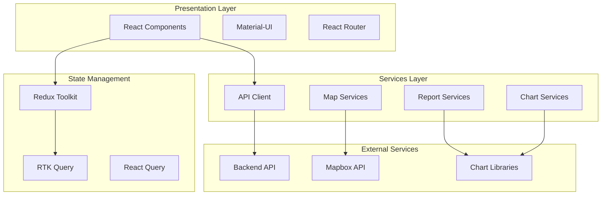

# Design do Dashboard Web - TreeInspector

## 🖥️ Arquitetura Web React

### Princípios de Design
- **Responsivo**: Funciona em desktop, tablet e mobile
- **Material-UI**: Interface consistente e profissional
- **Performance**: Carregamento rápido e otimizado
- **Acessibilidade**: Compatível com leitores de tela
- **Data-Driven**: Visualizações ricas em dados

## 🏗️ Arquitetura da Aplicação Web



## 📱 Layout Responsivo

### Desktop Layout (1200px+)
```
┌─────────────────────────────────────────────────────────┐
│ Header (AppBar)                                         │
├─────────────────────────────────────────────────────────┤
│ Sidebar │                Main Content                   │
│ (240px) │                                               │
│         │  ┌─────────────────────────────────────────┐  │
│ Menu    │  │                                         │  │
│ Items   │  │         Dashboard Content               │  │
│         │  │                                         │  │
│         │  │                                         │  │
│         │  └─────────────────────────────────────────┘  │
└─────────────────────────────────────────────────────────┘
```

### Tablet Layout (768px - 1199px)
```
┌─────────────────────────────────────────────────────────┐
│ Header with Menu Button                                 │
├─────────────────────────────────────────────────────────┤
│                                                         │
│              Full Width Content                         │
│                                                         │
│  ┌─────────────────────────────────────────────────┐    │
│  │                                                 │    │
│  │           Dashboard Content                     │    │
│  │                                                 │    │
│  └─────────────────────────────────────────────────┘    │
└─────────────────────────────────────────────────────────┘
```

### Mobile Layout (< 768px)
```
┌─────────────────────────────────┐
│ Header with Menu Button         │
├─────────────────────────────────┤
│                                 │
│        Stacked Content          │
│                                 │
│  ┌─────────────────────────┐    │
│  │                         │    │
│  │    Mobile Optimized     │    │
│  │       Content           │    │
│  │                         │    │
│  └─────────────────────────┘    │
└─────────────────────────────────┘
```

## 🎨 Design System

### Tema Material-UI
```javascript
const theme = createTheme({
  palette: {
    mode: 'light',
    primary: {
      main: '#2E7D32',      // Verde principal
      light: '#60AD5E',     // Verde claro
      dark: '#005005',      // Verde escuro
      contrastText: '#FFFFFF'
    },
    secondary: {
      main: '#FF8F00',      // Laranja
      light: '#FFC046',     // Laranja claro
      dark: '#C56000',      // Laranja escuro
      contrastText: '#000000'
    },
    error: {
      main: '#D32F2F',
      light: '#EF5350',
      dark: '#C62828'
    },
    warning: {
      main: '#FF9800',
      light: '#FFB74D',
      dark: '#F57C00'
    },
    success: {
      main: '#4CAF50',
      light: '#81C784',
      dark: '#388E3C'
    },
    background: {
      default: '#FAFAFA',
      paper: '#FFFFFF'
    }
  },
  typography: {
    fontFamily: '"Roboto", "Helvetica", "Arial", sans-serif',
    h1: { fontSize: '2.5rem', fontWeight: 300 },
    h2: { fontSize: '2rem', fontWeight: 400 },
    h3: { fontSize: '1.75rem', fontWeight: 400 },
    h4: { fontSize: '1.5rem', fontWeight: 500 },
    h5: { fontSize: '1.25rem', fontWeight: 500 },
    h6: { fontSize: '1rem', fontWeight: 500 }
  },
  shape: {
    borderRadius: 8
  },
  spacing: 8
});
```

### Cores por Categoria
```javascript
const categoryColors = {
  health: {
    otimo: '#4CAF50',     // Verde
    bom: '#8BC34A',       // Verde claro
    regular: '#FF9800',   // Laranja
    ruim: '#FF5722',      // Vermelho laranja
    critico: '#F44336'    // Vermelho
  },
  risk: {
    baixo: '#4CAF50',     // Verde
    moderado: '#FF9800',  // Laranja
    alto: '#FF5722',      // Vermelho laranja
    extremo: '#D32F2F'    // Vermelho escuro
  },
  urgency: {
    baixa: '#4CAF50',     // Verde
    media: '#FF9800',     // Laranja
    alta: '#FF5722',      // Vermelho laranja
    emergencial: '#D32F2F' // Vermelho escuro
  }
};
```

## 📊 Páginas Principais

### 1. Dashboard Overview
```jsx
const DashboardPage = () => {
  return (
    <Container maxWidth="xl">
      <Typography variant="h4" gutterBottom>
        Visão Geral
      </Typography>
      
      {/* KPI Cards */}
      <Grid container spacing={3} sx={{ mb: 3 }}>
        <Grid item xs={12} sm={6} md={3}>
          <StatsCard
            title="Total de Árvores"
            value={totalTrees}
            icon={<NatureIcon />}
            color="primary"
          />
        </Grid>
        
        <Grid item xs={12} sm={6} md={3}>
          <StatsCard
            title="Inspeções Este Mês"
            value={monthlyInspections}
            icon={<AssignmentIcon />}
            color="secondary"
          />
        </Grid>
        
        <Grid item xs={12} sm={6} md={3}>
          <StatsCard
            title="Árvores Críticas"
            value={criticalTrees}
            icon={<WarningIcon />}
            color="error"
          />
        </Grid>
        
        <Grid item xs={12} sm={6} md={3}>
          <StatsCard
            title="Ações Pendentes"
            value={pendingActions}
            icon={<BuildIcon />}
            color="warning"
          />
        </Grid>
      </Grid>
      
      {/* Charts Row */}
      <Grid container spacing={3} sx={{ mb: 3 }}>
        <Grid item xs={12} md={6}>
          <Paper sx={{ p: 2 }}>
            <Typography variant="h6" gutterBottom>
              Distribuição por Estado de Saúde
            </Typography>
            <HealthDistributionChart data={healthData} />
          </Paper>
        </Grid>
        
        <Grid item xs={12} md={6}>
          <Paper sx={{ p: 2 }}>
            <Typography variant="h6" gutterBottom>
              Inspeções por Mês
            </Typography>
            <InspectionTrendChart data={inspectionTrend} />
          </Paper>
        </Grid>
      </Grid>
      
      {/* Map and Recent Activity */}
      <Grid container spacing={3}>
        <Grid item xs={12} md={8}>
          <Paper sx={{ p: 2, height: 400 }}>
            <Typography variant="h6" gutterBottom>
              Mapa de Árvores
            </Typography>
            <TreeMap
              trees={trees}
              height={350}
              onMarkerClick={handleMarkerClick}
            />
          </Paper>
        </Grid>
        
        <Grid item xs={12} md={4}>
          <Paper sx={{ p: 2, height: 400 }}>
            <Typography variant="h6" gutterBottom>
              Atividade Recente
            </Typography>
            <RecentActivityList activities={recentActivities} />
          </Paper>
        </Grid>
      </Grid>
    </Container>
  );
};
```

### 2. Tree List Page
```jsx
const TreeListPage = () => {
  const [filters, setFilters] = useState({});
  const [page, setPage] = useState(0);
  const [rowsPerPage, setRowsPerPage] = useState(25);
  
  return (
    <Container maxWidth="xl">
      <Box sx={{ display: 'flex', justifyContent: 'space-between', mb: 3 }}>
        <Typography variant="h4">
          Árvores Cadastradas
        </Typography>
        
        <Button
          variant="contained"
          startIcon={<AddIcon />}
          onClick={() => navigate('/trees/new')}
        >
          Nova Árvore
        </Button>
      </Box>
      
      {/* Filters */}
      <Paper sx={{ p: 2, mb: 3 }}>
        <Grid container spacing={2} alignItems="center">
          <Grid item xs={12} sm={6} md={3}>
            <TextField
              fullWidth
              label="Buscar"
              value={filters.search}
              onChange={(e) => setFilters({...filters, search: e.target.value})}
              InputProps={{
                startAdornment: <SearchIcon />
              }}
            />
          </Grid>
          
          <Grid item xs={12} sm={6} md={2}>
            <FormControl fullWidth>
              <InputLabel>Estado de Saúde</InputLabel>
              <Select
                value={filters.health}
                onChange={(e) => setFilters({...filters, health: e.target.value})}
              >
                <MenuItem value="">Todos</MenuItem>
                <MenuItem value="otimo">Ótimo</MenuItem>
                <MenuItem value="bom">Bom</MenuItem>
                <MenuItem value="regular">Regular</MenuItem>
                <MenuItem value="ruim">Ruim</MenuItem>
                <MenuItem value="critico">Crítico</MenuItem>
              </Select>
            </FormControl>
          </Grid>
          
          <Grid item xs={12} sm={6} md={2}>
            <FormControl fullWidth>
              <InputLabel>Categoria de Risco</InputLabel>
              <Select
                value={filters.risk}
                onChange={(e) => setFilters({...filters, risk: e.target.value})}
              >
                <MenuItem value="">Todos</MenuItem>
                <MenuItem value="baixo">Baixo</MenuItem>
                <MenuItem value="moderado">Moderado</MenuItem>
                <MenuItem value="alto">Alto</MenuItem>
                <MenuItem value="extremo">Extremo</MenuItem>
              </Select>
            </FormControl>
          </Grid>
          
          <Grid item xs={12} sm={6} md={3}>
            <Autocomplete
              options={species}
              getOptionLabel={(option) => option.common_name}
              value={filters.species}
              onChange={(e, value) => setFilters({...filters, species: value})}
              renderInput={(params) => (
                <TextField {...params} label="Espécie" />
              )}
            />
          </Grid>
          
          <Grid item xs={12} sm={6} md={2}>
            <Button
              fullWidth
              variant="outlined"
              onClick={() => setFilters({})}
            >
              Limpar Filtros
            </Button>
          </Grid>
        </Grid>
      </Paper>
      
      {/* Data Table */}
      <Paper>
        <TableContainer>
          <Table>
            <TableHead>
              <TableRow>
                <TableCell>Etiqueta</TableCell>
                <TableCell>Espécie</TableCell>
                <TableCell>Endereço</TableCell>
                <TableCell>Estado de Saúde</TableCell>
                <TableCell>Categoria de Risco</TableCell>
                <TableCell>Última Inspeção</TableCell>
                <TableCell>Ações</TableCell>
              </TableRow>
            </TableHead>
            <TableBody>
              {trees.map((tree) => (
                <TableRow key={tree.id}>
                  <TableCell>
                    <Chip
                      label={tree.tag_number || `#${tree.id}`}
                      size="small"
                      variant="outlined"
                    />
                  </TableCell>
                  
                  <TableCell>
                    <Box>
                      <Typography variant="body2" fontWeight="medium">
                        {tree.species?.common_name}
                      </Typography>
                      <Typography variant="caption" color="text.secondary">
                        {tree.species?.scientific_name}
                      </Typography>
                    </Box>
                  </TableCell>
                  
                  <TableCell>
                    <Typography variant="body2">
                      {tree.address}
                    </Typography>
                  </TableCell>
                  
                  <TableCell>
                    <Chip
                      label={tree.health_status}
                      size="small"
                      sx={{
                        backgroundColor: categoryColors.health[tree.health_status],
                        color: 'white'
                      }}
                    />
                  </TableCell>
                  
                  <TableCell>
                    <Chip
                      label={tree.risk_category}
                      size="small"
                      sx={{
                        backgroundColor: categoryColors.risk[tree.risk_category],
                        color: 'white'
                      }}
                    />
                  </TableCell>
                  
                  <TableCell>
                    <Typography variant="body2">
                      {formatDate(tree.last_inspection)}
                    </Typography>
                  </TableCell>
                  
                  <TableCell>
                    <IconButton
                      size="small"
                      onClick={() => navigate(`/trees/${tree.id}`)}
                    >
                      <VisibilityIcon />
                    </IconButton>
                    
                    <IconButton
                      size="small"
                      onClick={() => navigate(`/trees/${tree.id}/edit`)}
                    >
                      <EditIcon />
                    </IconButton>
                    
                    <IconButton
                      size="small"
                      onClick={() => navigate(`/trees/${tree.id}/map`)}
                    >
                      <LocationOnIcon />
                    </IconButton>
                  </TableCell>
                </TableRow>
              ))}
            </TableBody>
          </Table>
        </TableContainer>
        
        <TablePagination
          component="div"
          count={totalTrees}
          page={page}
          onPageChange={handleChangePage}
          rowsPerPage={rowsPerPage}
          onRowsPerPageChange={handleChangeRowsPerPage}
          rowsPerPageOptions={[10, 25, 50, 100]}
        />
      </Paper>
    </Container>
  );
};
```

### 3. Tree Detail Page
```jsx
const TreeDetailPage = () => {
  const { id } = useParams();
  const { data: tree, isLoading } = useGetTreeQuery(id);
  
  if (isLoading) return <LoadingSpinner />;
  
  return (
    <Container maxWidth="xl">
      <Box sx={{ display: 'flex', justifyContent: 'space-between', mb: 3 }}>
        <Box>
          <Typography variant="h4" gutterBottom>
            {tree.tag_number || `Árvore #${tree.id}`}
          </Typography>
          <Typography variant="subtitle1" color="text.secondary">
            {tree.species?.common_name} ({tree.species?.scientific_name})
          </Typography>
        </Box>
        
        <Box>
          <Button
            variant="outlined"
            startIcon={<EditIcon />}
            onClick={() => navigate(`/trees/${id}/edit`)}
            sx={{ mr: 1 }}
          >
            Editar
          </Button>
          
          <Button
            variant="contained"
            startIcon={<AddIcon />}
            onClick={() => navigate(`/inspections/new?tree=${id}`)}
          >
            Nova Inspeção
          </Button>
        </Box>
      </Box>
      
      <Grid container spacing={3}>
        {/* Basic Info */}
        <Grid item xs={12} md={4}>
          <Paper sx={{ p: 2 }}>
            <Typography variant="h6" gutterBottom>
              Informações Básicas
            </Typography>
            
            <List>
              <ListItem>
                <ListItemIcon><LocationOnIcon /></ListItemIcon>
                <ListItemText
                  primary="Endereço"
                  secondary={tree.address}
                />
              </ListItem>
              
              <ListItem>
                <ListItemIcon><NatureIcon /></ListItemIcon>
                <ListItemText
                  primary="Espécie"
                  secondary={`${tree.species?.common_name} (${tree.species?.scientific_name})`}
                />
              </ListItem>
              
              <ListItem>
                <ListItemIcon><CalendarTodayIcon /></ListItemIcon>
                <ListItemText
                  primary="Cadastrada em"
                  secondary={formatDate(tree.created_at)}
                />
              </ListItem>
              
              <ListItem>
                <ListItemIcon><AssignmentIcon /></ListItemIcon>
                <ListItemText
                  primary="Total de Inspeções"
                  secondary={tree.inspection_count}
                />
              </ListItem>
            </List>
          </Paper>
        </Grid>
        
        {/* Current Status */}
        <Grid item xs={12} md={4}>
          <Paper sx={{ p: 2 }}>
            <Typography variant="h6" gutterBottom>
              Estado Atual
            </Typography>
            
            <Box sx={{ mb: 2 }}>
              <Typography variant="body2" color="text.secondary">
                Estado de Saúde
              </Typography>
              <Chip
                label={tree.current_health}
                sx={{
                  backgroundColor: categoryColors.health[tree.current_health],
                  color: 'white',
                  mt: 0.5
                }}
              />
            </Box>
            
            <Box sx={{ mb: 2 }}>
              <Typography variant="body2" color="text.secondary">
                Categoria de Risco
              </Typography>
              <Chip
                label={tree.current_risk}
                sx={{
                  backgroundColor: categoryColors.risk[tree.current_risk],
                  color: 'white',
                  mt: 0.5
                }}
              />
            </Box>
            
            <Box sx={{ mb: 2 }}>
              <Typography variant="body2" color="text.secondary">
                DAP Atual
              </Typography>
              <Typography variant="h6">
                {tree.current_dbh} cm
              </Typography>
            </Box>
            
            <Box>
              <Typography variant="body2" color="text.secondary">
                Altura Total
              </Typography>
              <Typography variant="h6">
                {tree.current_height} m
              </Typography>
            </Box>
          </Paper>
        </Grid>
        
        {/* Map */}
        <Grid item xs={12} md={4}>
          <Paper sx={{ p: 2 }}>
            <Typography variant="h6" gutterBottom>
              Localização
            </Typography>
            
            <Box sx={{ height: 250 }}>
              <TreeMap
                trees={[tree]}
                center={[tree.longitude, tree.latitude]}
                zoom={16}
                height={250}
              />
            </Box>
            
            <Typography variant="caption" color="text.secondary" sx={{ mt: 1, display: 'block' }}>
              Lat: {tree.latitude.toFixed(6)}, Lng: {tree.longitude.toFixed(6)}
            </Typography>
          </Paper>
        </Grid>
        
        {/* Inspection History Chart */}
        <Grid item xs={12} md={8}>
          <Paper sx={{ p: 2 }}>
            <Typography variant="h6" gutterBottom>
              Histórico de Saúde
            </Typography>
            
            <HealthHistoryChart
              data={tree.health_history}
              height={300}
            />
          </Paper>
        </Grid>
        
        {/* Pending Actions */}
        <Grid item xs={12} md={4}>
          <Paper sx={{ p: 2 }}>
            <Typography variant="h6" gutterBottom>
              Ações Pendentes
            </Typography>
            
            {tree.pending_actions?.length > 0 ? (
              <List>
                {tree.pending_actions.map((action) => (
                  <ListItem key={action.id}>
                    <ListItemIcon>
                      <BuildIcon color={
                        action.urgency === 'emergencial' ? 'error' :
                        action.urgency === 'alta' ? 'warning' : 'primary'
                      } />
                    </ListItemIcon>
                    <ListItemText
                      primary={action.proposed_action}
                      secondary={`Urgência: ${action.urgency}`}
                    />
                  </ListItem>
                ))}
              </List>
            ) : (
              <Typography variant="body2" color="text.secondary">
                Nenhuma ação pendente
              </Typography>
            )}
          </Paper>
        </Grid>
        
        {/* Recent Inspections */}
        <Grid item xs={12}>
          <Paper sx={{ p: 2 }}>
            <Typography variant="h6" gutterBottom>
              Inspeções Recentes
            </Typography>
            
            <InspectionHistoryTable
              inspections={tree.recent_inspections}
              onViewInspection={(inspection) => navigate(`/inspections/${inspection.id}`)}
            />
          </Paper>
        </Grid>
      </Grid>
    </Container>
  );
};
```

### 4. Interactive Map Page
```jsx
const TreeMapPage = () => {
  const [filters, setFilters] = useState({});
  const [selectedTree, setSelectedTree] = useState(null);
  const [mapStyle, setMapStyle] = useState('streets');
  
  return (
    <Container maxWidth="xl" sx={{ height: 'calc(100vh - 100px)' }}>
      <Box sx={{ display: 'flex', height: '100%' }}>
        {/* Map Controls Sidebar */}
        <Paper sx={{ width: 300, p: 2, mr: 2, overflow: 'auto' }}>
          <Typography variant="h6" gutterBottom>
            Controles do Mapa
          </Typography>
          
          {/* Map Style Selector */}
          <FormControl fullWidth sx={{ mb: 2 }}>
            <InputLabel>Estilo do Mapa</InputLabel>
            <Select
              value={mapStyle}
              onChange={(e) => setMapStyle(e.target.value)}
            >
              <MenuItem value="streets">Ruas</MenuItem>
              <MenuItem value="satellite">Satélite</MenuItem>
              <MenuItem value="hybrid">Híbrido</MenuItem>
              <MenuItem value="terrain">Terreno</MenuItem>
            </Select>
          </FormControl>
          
          {/* Filters */}
          <Typography variant="subtitle2" gutterBottom>
            Filtros
          </Typography>
          
          <FormGroup>
            <FormControlLabel
              control={
                <Checkbox
                  checked={filters.showHealthy}
                  onChange={(e) => setFilters({...filters, showHealthy: e.target.checked})}
                />
              }
              label="Árvores Saudáveis"
            />
            
            <FormControlLabel
              control={
                <Checkbox
                  checked={filters.showCritical}
                  onChange={(e) => setFilters({...filters, showCritical: e.target.checked})}
                />
              }
              label="Árvores Críticas"
            />
            
            <FormControlLabel
              control={
                <Checkbox
                  checked={filters.showHighRisk}
                  onChange={(e) => setFilters({...filters, showHighRisk: e.target.checked})}
                />
              }
              label="Alto Risco"
            />
          </FormGroup>
          
          {/* Legend */}
          <Typography variant="subtitle2" gutterBottom sx={{ mt: 2 }}>
            Legenda
          </Typography>
          
          <List dense>
            <ListItem>
              <ListItemIcon>
                <CircleIcon sx={{ color: categoryColors.health.otimo }} />
              </ListItemIcon>
              <ListItemText primary="Ótimo" />
            </ListItem>
            
            <ListItem>
              <ListItemIcon>
                <CircleIcon sx={{ color: categoryColors.health.bom }} />
              </ListItemIcon>
              <ListItemText primary="Bom" />
            </ListItem>
            
            <ListItem>
              <ListItemIcon>
                <CircleIcon sx={{ color: categoryColors.health.regular }} />
              </ListItemIcon>
              <ListItemText primary="Regular" />
            </ListItem>
            
            <ListItem>
              <ListItemIcon>
                <CircleIcon sx={{ color: categoryColors.health.ruim }} />
              </ListItemIcon>
              <ListItemText primary="Ruim" />
            </ListItem>
            
            <ListItem>
              <ListItemIcon>
                <CircleIcon sx={{ color: categoryColors.health.critico }} />
              </ListItemIcon>
              <ListItemText primary="Crítico" />
            </ListItem>
          </List>
          
          {/* Selected Tree Info */}
          {selectedTree && (
            <Box sx={{ mt: 2 }}>
              <Typography variant="subtitle2" gutterBottom>
                Árvore Selecionada
              </Typography>
              
              <Card>
                <CardContent>
                  <Typography variant="h6">
                    {selectedTree.tag_number || `#${selectedTree.id}`}
                  </Typography>
                  
                  <Typography variant="body2" color="text.secondary">
                    {selectedTree.species?.common_name}
                  </Typography>
                  
                  <Typography variant="body2" sx={{ mt: 1 }}>
                    {selectedTree.address}
                  </Typography>
                  
                  <Box sx={{ mt: 2 }}>
                    <Button
                      size="small"
                      variant="outlined"
                      onClick={() => navigate(`/trees/${selectedTree.id}`)}
                    >
                      Ver Detalhes
                    </Button>
                  </Box>
                </CardContent>
              </Card>
            </Box>
          )}
        </Paper>
        
        {/* Map Container */}
        <Paper sx={{ flex: 1, position: 'relative' }}>
          <InteractiveTreeMap
            trees={filteredTrees}
            style={mapStyle}
            onTreeSelect={setSelectedTree}
            selectedTree={selectedTree}
            filters={filters}
          />
          
          {/* Map Toolbar */}
          <Box sx={{
            position: 'absolute',
            top: 16,
            right: 16,
            display: 'flex',
            flexDirection: 'column',
            gap: 1
          }}>
            <Tooltip title="Centralizar no usuário">
              <IconButton
                sx={{ backgroundColor: 'white' }}
                onClick={centerOnUser}
              >
                <MyLocationIcon />
              </IconButton>
            </Tooltip>
            
            <Tooltip title="Zoom para todas as árvores">
              <IconButton
                sx={{ backgroundColor: 'white' }}
                onClick={fitAllTrees}
              >
                <CenterFocusStrongIcon />
              </IconButton>
            </Tooltip>
            
            <Tooltip title="Alternar clustering">
              <IconButton
                sx={{ backgroundColor: 'white' }}
                onClick={toggleClustering}
              >
                <GroupWorkIcon />
              </IconButton>
            </Tooltip>
          </Box>
        </Paper>
      </Box>
    </Container>
  );
};
```

## 📊 Componentes de Visualização

### Health Distribution Chart
```jsx
const HealthDistributionChart = ({ data }) => {
  const chartData = Object.entries(data).map(([status, count]) => ({
    name: status,
    value: count,
    color: categoryColors.health[status]
  }));
  
  return (
    <ResponsiveContainer width="100%" height={300}>
      <PieChart>
        <Pie
          data={chartData}
          cx="50%"
          cy="50%"
          outerRadius={80}
          fill="#8884d8"
          dataKey="value"
          label={({ name, percent }) => `${name} ${(percent * 100).toFixed(0)}%`}
        >
          {chartData.map((entry, index) => (
            <Cell key={`cell-${index}`} fill={entry.color} />
          ))}
        </Pie>
        <Tooltip />
        <Legend />
      </PieChart>
    </ResponsiveContainer>
  );
};
```

### Inspection Trend Chart
```jsx
const InspectionTrendChart = ({ data }) => {
  return (
    <ResponsiveContainer width="100%" height={300}>
      <LineChart data={data}>
        <CartesianGrid strokeDasharray="3 3" />
        <XAxis dataKey="month" />
        <YAxis />
        <Tooltip />
        <Legend />
        <Line
          type="monotone"
          dataKey="inspections"
          stroke="#2E7D32"
          strokeWidth={2}
          dot={{ fill: '#2E7D32' }}
        />
      </LineChart>
    </ResponsiveContainer>
  );
};
```

### Interactive Tree Map
```jsx
const InteractiveTreeMap = ({
  trees,
  style,
  onTreeSelect,
  selectedTree,
  filters
}) => {
  const mapRef = useRef();
  
  const filteredTrees = useMemo(() => {
    return trees.filter(tree => {
      if (filters.showHealthy && tree.health_status === 'otimo') return true;
      if (filters.showCritical && tree.health_status === 'critico') return true;
      if (filters.showHighRisk && tree.risk_category === '